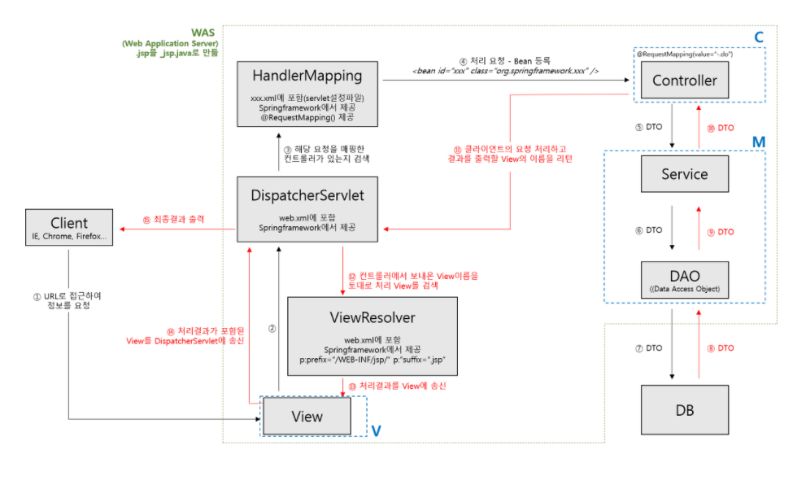

# chap21 스프링 MVC 기능

## 21.1 스프링 프레임워크 MVC의 특징

특징

- 모델2 아키텍처를 지원
- 스프링과 다른 모듈과의 연계가 쉽다.
- 타일즈(tiles)나 사이트메시(sitemesh) 같은 view 기수과의 연계가 쉽다.
- 태그 라이브러리를 통해 message 출력, theme 적용 그리고 입력 폼을 보다 쉽게 구현할 수 있다.
- 
- DispatcherServlet : 클라이언트의 요청을 전달받아 해당 요청에 대한 컨트롤러를 선택하여 클라이언트의 요청을 전달 또한 컨트롤러가 반환한 값을 View에 전달하여 알맞은 응답을 생성
- HandlerMapping : 클라이언트가 요청한 URL을 처리할 컨트롤러를 지정
- Controller : 클라이언트의 요청을 처리한 후 그 결과를 DispatcherServlet에 전달
- ModelAndView : 컨트롤러가 처리한 결과 및 뷰 선택에 필요한 정보를 저장
- View : 컨트롤러의 처리 결과 화면을 생성
